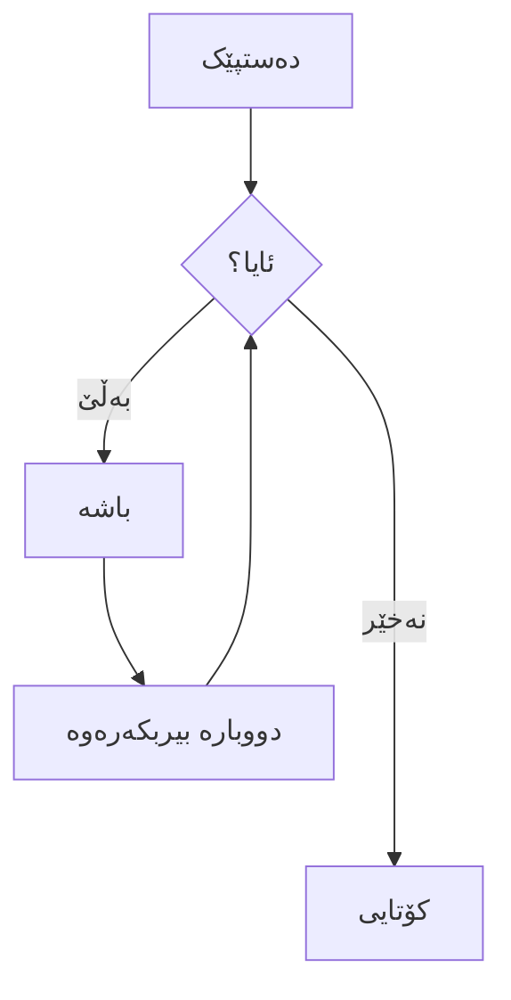



لێرەدا نموونەیەک لە ناونیشانەکان هەیە. دەتوانیت ئەم ناونیشانانە بە ڕێگای یاساکانی markdown بەکاربێنیت. بۆ نموونە: `#` بەکاربێنە بۆ ناونیشانی ١ و `######` بەکاربێنە بۆ ناونیشانی ٦.

# ناونیشانی ١

## ناونیشانی ٢

### ناونیشانی ٣

#### ناونیشانی ٤

##### ناونیشانی ٥

###### ناونیشانی ٦

<hr>

### جەختکردنەوە

جەختکردنەوە، واتا خوارکردنەوە، بە _ئەستێرە_ یان _هێڵی خوارەوە_.

جەختکردنەوەی بەهێز، واتا قەڵەو، بە **ئەستێرە** یان **هێڵی خوارەوە**.

جەختکردنەوەی تێکەڵاو بە **ئەستێرە و _هێڵی خوارەوە_**.

هێڵکێشان بە دوو تیلدە. ~~ئەمە بسڕەوە.~~

<hr>

### دووگمە



<hr>

### بەستەر

[من بەستەرێکی ناوهێڵم](https://www.google.com)

[من بەستەرێکی ناوهێڵم بە ناونیشان](https://www.google.com "پەڕەی سەرەکی گووگڵ")

[من بەستەرێکی سەرچاوەیی ڕەفرانسم][دەقی ڕەفرانسی نادیار لە گەورە و بچووک]

[من ڕەفرانسێکی نیسبی بۆ فایلی خەزنەم](../blob/master/LICENSE)

[دەتوانیت ژمارە بەکاربێنیت بۆ پێناسەی بەستەری ڕەفرانسی][1]

یان بە واڵای بەجێی بێڵیت و [دەقی بەستەرەکە] بەکاربێنیت.

URLەکان و URLەکان لە براکێتی گۆشەیی دا بە خۆکاری دەبنە بەستەر.
<http://www.example.com> یان <http://www.example.com> و جارێکجار
example.com (بەڵام لە Github دا نا، بۆ نموونە).

هەندێک دەق بۆ پیشاندانی ئەوەی کە بەستەرە ڕەفرانسییەکان دەتوانن دواتر بێن.

[دەقی ڕەفرانسی نادیار لە گەورە و بچووک]: https://www.themefisher.com
[1]: https://gethugothemes.com
[دەقی بەستەرەکە]: https://www.getjekyllthemes.com

<hr>

### پەڕەگراف

لۆرێم ئیپسوم دۆلۆر سیت ئامێت کۆنسێکتێتوور ئادیپیسیسنگ ئێلیت. کوام نیهیل ئێنیم مکسیمە کۆرپۆریس کومکوێ تۆتام ئالیکوید نام سینت ئینڤێنتۆرە ئۆپتیۆ مۆدی نێکوێ لابۆروم ئۆفیسیس نێسێسیتاتیبوس، فاسیلیس پلاسێئات پاریاتوور! ڤۆلوپتاتێم، سێد هاروم پاریاتوور ئادیپیسی ڤۆلوپتاتێس ڤۆلوپتاتوم کومکوێ، پۆرۆ سینت مینیما سیمیلیکوێ مگنی پێرفێرێندیس فوگا! ئۆپتیۆ ڤێل ئیپسوم ئیکسێپتووری تێمپۆرە رێیسیێندیس ئاید کویدێم؟

<hr>

### لیستی ڕیزبەند

١. دانەی لیست
٢. دانەی لیست
٣. دانەی لیست
٤. دانەی لیست
٥. دانەی لیست

<hr>

### لیستی ڕیزنەبەند

- دانەی لیست
- دانەی لیست
- دانەی لیست
- دانەی لیست
- دانەی لیست

<hr>

### ئاگادارکردنەوە


ئەمە تێبینییەکی سادەیە.



ئەمە ئامۆژگارییەکی سادەیە.



ئەمە زانیارییەکی سادەیە.



ئەمە ئاگادارکردنەوەیەکی سادەیە.


<hr>

### تابەکان




#### سڵاو لەوێ، من تابێکم

لۆرێم ئیپسوم دۆلۆر سیت ئامێت، کۆنسێتێتوور سادیپسینگ ئێلیتر، سێد دیام نۆنومی ئێیرمۆد تێمپۆر ئینڤیدونت ئووت لابۆرە ئێت دۆلۆرە مگنا ئالیکویام ئێرات، سێد دیام ڤۆلوپتوا. ئات ڤێرۆ ئێۆس ئێت ئاکووسام ئێت جوستۆ دوۆ دۆلۆرێس ئێت ئێا رێبوم. ستێت کلیتا کاسد گوبێرگرێن، نۆ سێا تاکیماتا سانکتوس ئێست لۆرێم ئیپسوم دۆلۆر سیت ئامێت.





#### دەمەوێت دەربارەی هەوڵی کوشتن قسە بکەم

لۆرێم ئیپسوم دۆلۆر سیت ئامێت، کۆنسێتێتوور سادیپسینگ ئێلیتر، سێد دیام نۆنومی ئێیرمۆد تێمپۆر ئینڤیدونت ئووت لابۆرە ئێت دۆلۆرە مگنا ئالیکویام ئێرات، سێد دیام ڤۆلوپتوا. ئات ڤێرۆ ئێۆس ئێت ئاکووسام ئێت جوستۆ دوۆ دۆلۆرێس ئێت ئێا رێبوم. ستێت کلیتا کاسد گوبێرگرێن، نۆ سێا تاکیماتا سانکتوس ئێست لۆرێم ئیپسوم دۆلۆر سیت ئامێت.

لۆرێم ئیپسوم دۆلۆر سیت ئامێت، کۆنسێتێتوور سادیپسینگ ئێلیتر، سێد دیام نۆنومی ئێیرمۆد تێمپۆر ئینڤیدونت ئووت لابۆرە ئێت دۆلۆرە مگنا ئالیکویام ئێرات، سێد دیام ڤۆلوپتوا.





#### ئێمە دەزانین تۆ مامەڵە بە کانزای دزراو دەکەیت

لۆرێم ئیپسوم دۆلۆر سیت ئامێت، کۆنسێتێتوور سادیپسینگ ئێلیتر، سێد دیام نۆنومی ئێیرمۆد تێمپۆر ئینڤیدونت ئووت لابۆرە ئێت دۆلۆرە مگنا ئالیکویام ئێرات، سێد دیام ڤۆلوپتوا. ئات ڤێرۆ ئێۆس ئێت ئاکووسام ئێت جوستۆ دوۆ دۆلۆرێس ئێت ئێا رێبوم. ستێت کلیتا کاسد گوبێرگرێن، نۆ سێا تاکیماتا سانکتوس ئێست لۆرێم ئیپسوم دۆلۆر سیت ئامێت.

لۆرێم ئیپسوم دۆلۆر سیت ئامێت، کۆنسێتێتوور سادیپسینگ ئێلیتر، سێد دیام نۆنومی ئێیرمۆد تێمپۆر ئینڤیدونت ئووت لابۆرە ئێت دۆلۆرە مگنا ئالیکویام ئێرات، سێد دیام ڤۆلوپتوا. ئات ڤێرۆ ئێۆس ئێت ئاکووسام ئێت جوستۆ دوۆ




<hr>

### ئاکۆردیۆنەکان



- لۆرێم ئیپسوم دۆلۆر سیت ئامێت کۆنسێکتێتوور ئادیپیسیسنگ ئێلیت.
- لۆرێم ئیپسوم دۆلۆر سیت ئامێت کۆنسێکتێتوور ئادیپیسیسنگ ئێلیت.
- لۆرێم ئیپسوم دۆلۆر سیت ئامێت کۆنسێکتێتوور





- لۆرێم ئیپسوم دۆلۆر سیت ئامێت کۆنسێکتێتوور ئادیپیسیسنگ ئێلیت.
- لۆرێم ئیپسوم دۆلۆر سیت ئامێت کۆنسێکتێتوور ئادیپیسیسنگ ئێلیت.
- لۆرێم ئیپسوم دۆلۆر سیت ئامێت کۆنسێکتێتوور





- لۆرێم ئیپسوم دۆلۆر سیت ئامێت کۆنسێکتێتوور ئادیپیسیسنگ ئێلیت.
- لۆرێم ئیپسوم دۆلۆر سیت ئامێت کۆنسێکتێتوور ئادیپیسیسنگ ئێلیت.
- لۆرێم ئیپسوم دۆلۆر سیت ئامێت کۆنسێکتێتوور



<hr>

### کۆد و ڕووناککردنەوەی سینتاکس

ئەمە نموونەیەکی `کۆدی ناوهێڵ`ە.

```javascript
var s = "ڕووناککردنەوەی سینتاکسی JavaScript";
alert(s);
```

```python
s = "ڕووناککردنەوەی سینتاکسی Python"
print s
```

```c  { linenos=true }
#include <stdio.h>

int main(void)
{
    printf("سڵاو، جیهان\n");
    return 0;
}
```



<hr>

### بلۆک وتە

> ئایا بۆ شتێکی تایبەت هاتیت ئێرە یان تەنها بۆ باشکردنی گشتی ڕایکەر؟ و فووکردن بۆ نێو خێرایی warp ی زۆرینە، بۆ چرکەیەک دەرکەوتیت وەک لە دوو شوێن بیت لە هەمان کاتدا.

<hr>

### خشتەکان

| خشتەکان        |   ناوەندن    |  فێنک |
| ------------- | :-----------: | -----: |
| ستوونی ٣      | ڕاستکراو     | $١٦٠٠ |
| ستوونی ٢      |   ناوەندکراو   |   $١٢ |
| هێڵە زێبراییەکان |  جوانن      |    $١ |

<hr>

### وێنە



<hr>

### گالەری



<hr>

### سلایدەر



<hr>

### ڤیدیۆی یوتیوب



<hr>

### ڤیدیۆی دەستکاری

